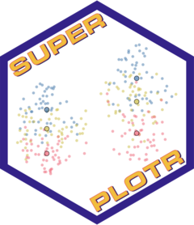
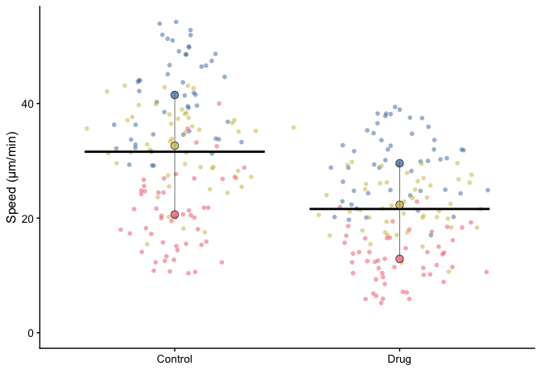

<!-- README.md is generated from README.Rmd. Please edit that file -->

# SuperPlotR <a href="https://quantixed.github.io/SuperPlotR/"></a>

<!-- badges: start -->
<!-- badges: end -->

The goal of SuperPlotR is to allow the user to easily generate
SuperPlots in R.

SuperPlots are a way to visualise data in a way that emphasises the
experimental reproducibility. You can read more about SuperPlots in the
[original paper](https://doi.org/10.1083/jcb.202001064):

Lord *et al.* (2020) SuperPlots: Communicating reproducibility and
variability in cell biology. *J. Cell Biol.* 219(6):e202001064

## Installation

You can install the development version of SuperPlotR from
[GitHub](https://github.com/) with:

``` r
# install.packages("devtools")
devtools::install_github("quantixed/SuperPlotR")
```

## Example

A simple example of how to use SuperPlotR is shown below:

``` r
library(SuperPlotR)
superplot(lord_jcb, "Speed", "Treatment", "Replicate", ylab = "Speed (µm/min)")
```



The data used in this example is included in the package and is from the
original paper.

To generate a SuperPlot, you need a data frame that has at least three
columns. These columns are:

1.  the variable that is measured in the experiment,
2.  the experimental condition,
3.  the experimental repeat that the measurment comes from.

The `superplot` function takes the data frame, the names of these three
columns, and is further customisable with additional arguments.

See `vignette("SuperPlotR")` for more examples, or
`vignette("advanced")` for more advanced usage.

## More information

My SuperPlot package for IGOR Pro is available
[here](https://github.com/quantixed/SuperPlot)

A popular web-based app for generating SuperPlots, developed by [Joachim
Goedhart](https://github.com/JoachimGoedhart) is available
[here](https://huygens.science.uva.nl/SuperPlotsOfData/)
