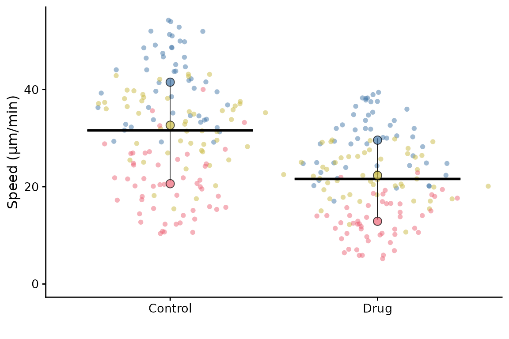
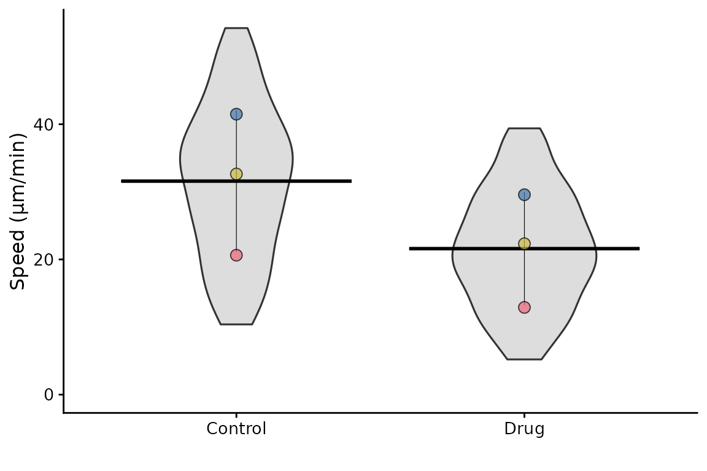
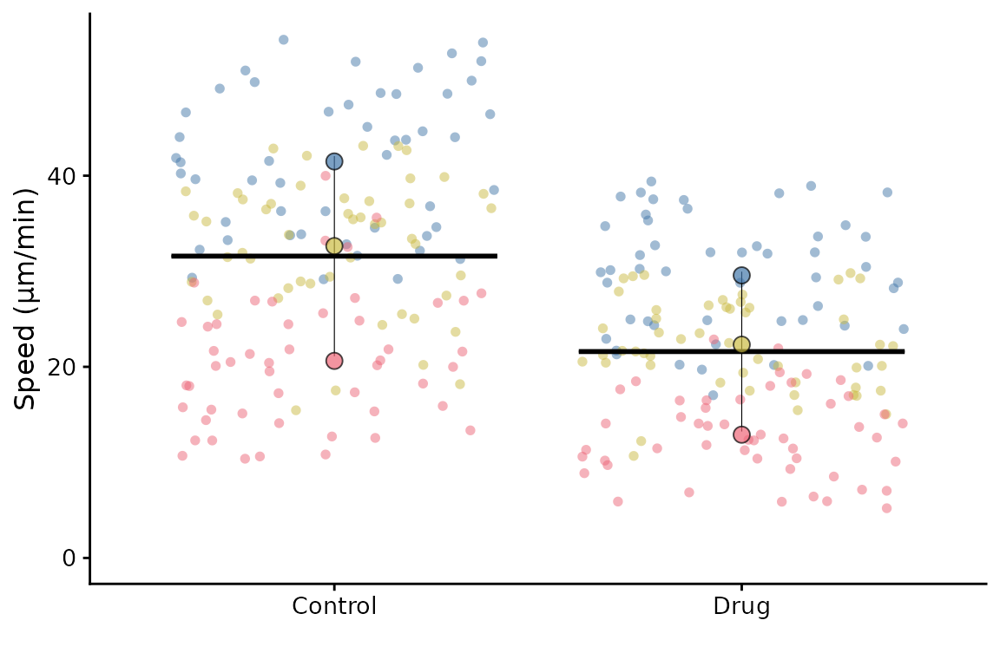
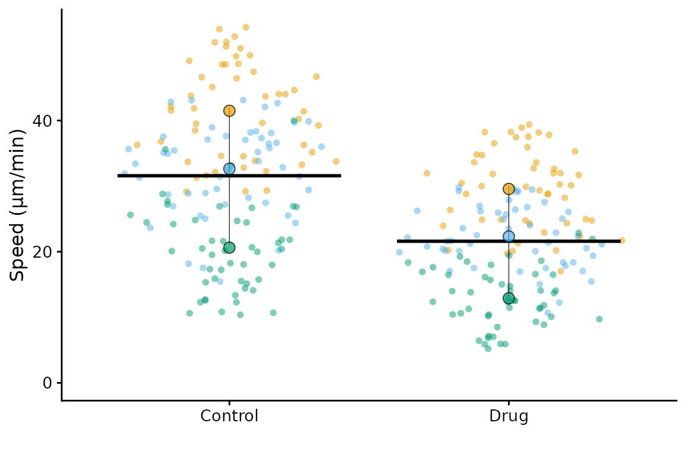
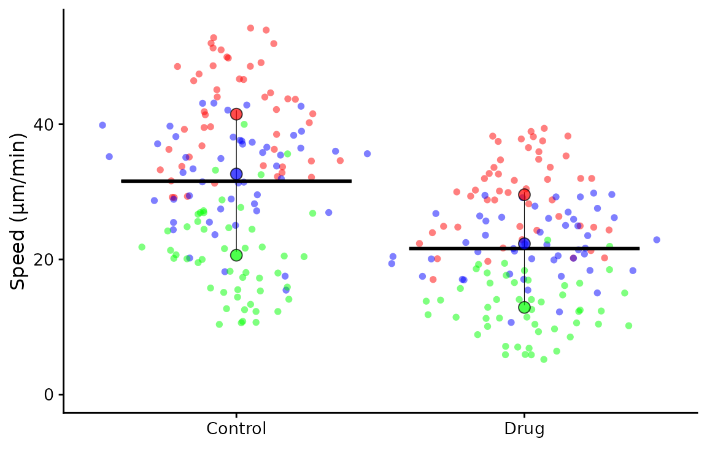
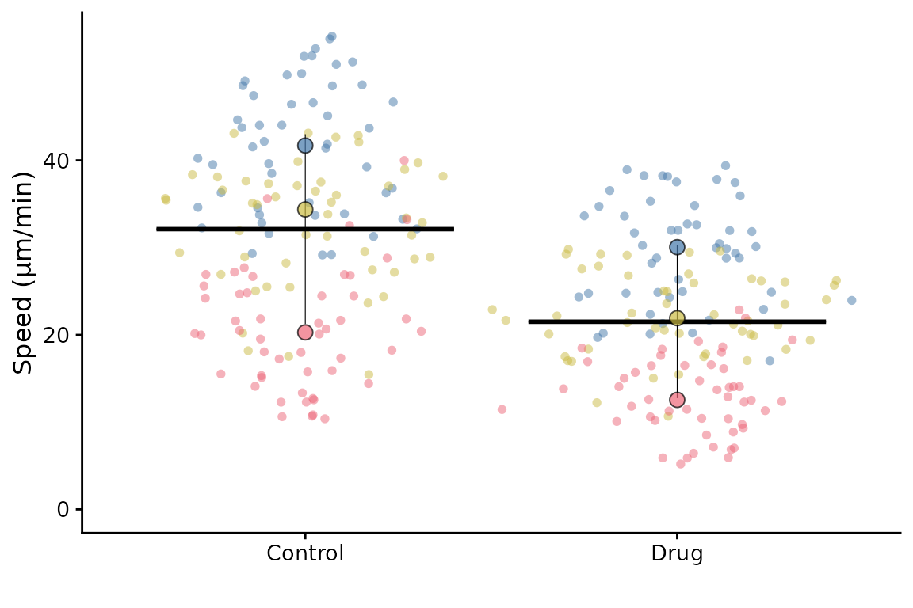
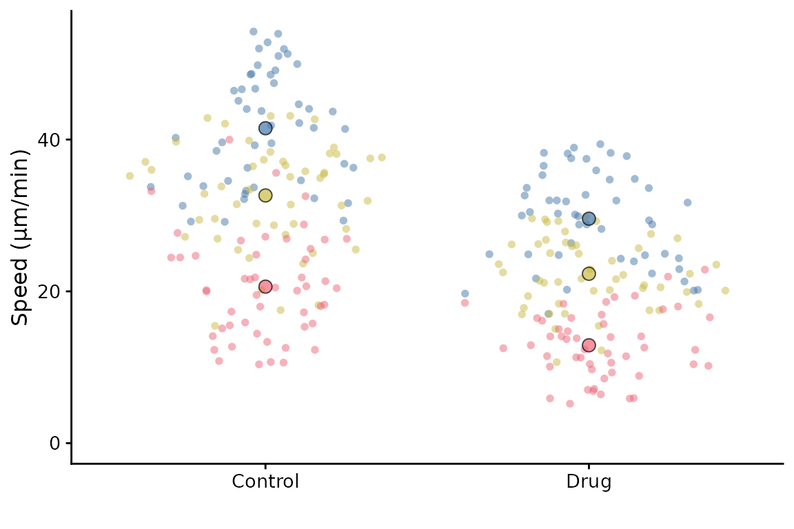
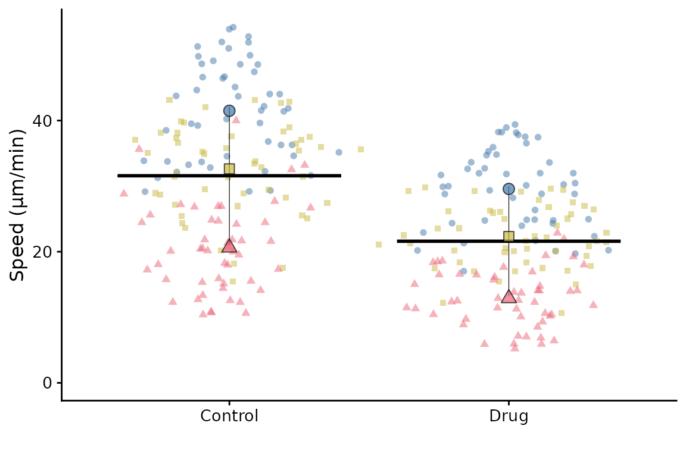
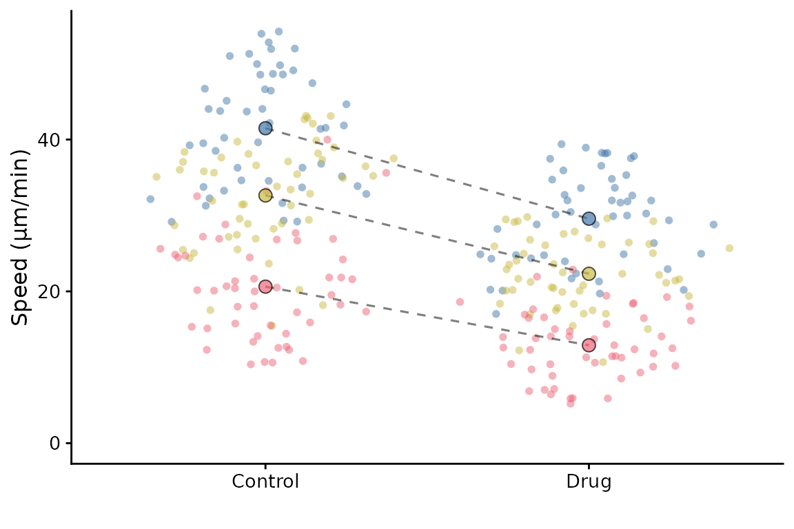
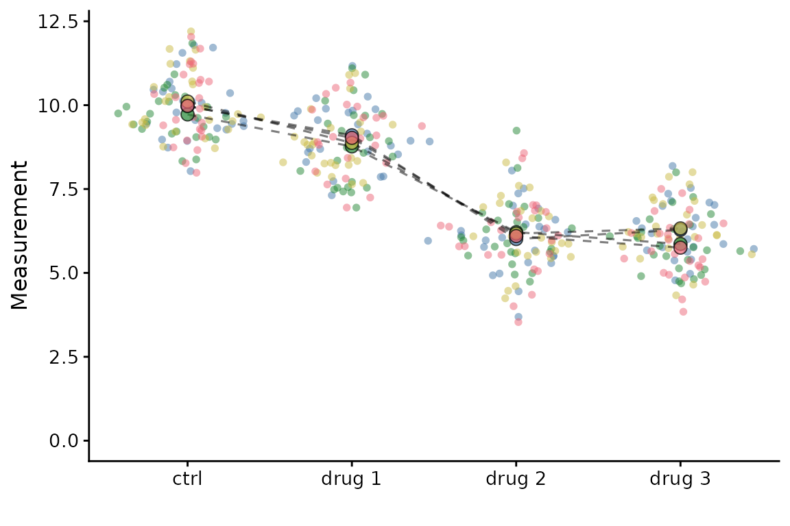

# Getting Started

## A basic SuperPlot

Example data from the original paper is included in the package. We’ll
use this for demonstration. The data is called `lord_jcb`. A basic
SuperPlot can be generated with the following code:

``` r
library(SuperPlotR)
superplot(lord_jcb, "Speed", "Treatment", "Replicate", ylab = "Speed (µm/min)")
```


This will generate a SuperPlot of the `Speed` data, with `Treatment` on
the x-axis and `Replicate` is used to group the data. The y-axis label
is set to “Speed”.

An equivalent call in long form is:

``` r
superplot(
  df = lord_jcb,
  meas = "Speed",
  cond = "Treatment",
  repl = "Replicate",
  ylab = "Speed (µm/min)"
)
```



## Customising the SuperPlot

A separate vignette describes how to customise the sizing of the plot.
Here, we will look at major customisation options.

### Data distribution

The underlying data can be rendered as violins,

``` r
superplot(lord_jcb, "Speed", "Treatment", "Replicate",
          ylab = "Speed (µm/min)", datadist = "violin")
```



or with a jittered scatter plot, the default (shown in the first example
on this page) uses `sina` which is a jittered scatter plot with a
density estimate.

``` r
superplot(lord_jcb, "Speed", "Treatment", "Replicate",
          ylab = "Speed (µm/min)", datadist = "jitter")
```



### Colours

The colours of the points can be changed. The default is Paul Tol’s
bright palette (`"tol_bright"`) but you can select from:

- `"tol_bright"`
- `"tol_vibrant"`
- `"tol_muted"`
- `"tol_light"`
- or Color Universal Design (`"cud"`)

``` r
superplot(lord_jcb, "Speed", "Treatment", "Replicate",
          ylab = "Speed (µm/min)", pal = "cud")
```



It’s possible to supply your own palette as a vector of colours (in hex
or description format)

``` r
superplot(lord_jcb, "Speed", "Treatment", "Replicate",
          ylab = "Speed (µm/min)", pal = c("#ff0000", "blue", "green"))
```



### Summary points

The mean of each replicate is shown by default. You can show the median
instead

``` r
superplot(lord_jcb, "Speed", "Treatment", "Replicate",
          ylab = "Speed (µm/min)", rep_summary = "rep_median")
```



### Bars

The default SuperPlot includes bars to indicate the mean ± sd. They can
be modified by using the `bars` argument. Options are:

- `"mean_sd"` = mean ± standard deviation
- `"mean_sem"` = mean ± standard error of the mean
- `"mean_ci"` = mean ± 95% confidence interval
- `"none"` = no error bars, but still show the mean with a crossbar
- `""` = no bars and no crossbar

Note that these bars show the mean ± error of the *replicate means* not
the underlying data points.

``` r
# remove bars
superplot(lord_jcb, "Speed", "Treatment", "Replicate",
          ylab = "Speed (µm/min)", bars = "")
```



### Data point shapes

By default, all data points are circles. If you want to use different
shapes for different conditions, you can use the `shapes` argument. Set
to `TRUE` to use different shapes for each replicate.

``` r
superplot(lord_jcb, "Speed", "Treatment", "Replicate",
          ylab = "Speed (µm/min)", shapes = TRUE)
```



If you’d like to link the summary points, set `linking = TRUE`.

``` r
superplot(lord_jcb, "Speed", "Treatment", "Replicate",
          ylab = "Speed (µm/min)", linking = TRUE)
```



Linkages can be made when there are more than two groups. To demonstrate
this we will use some toy data:

``` r
set.seed(123)
example <- data.frame(meas = rep(rep(c(10, 9, 6, 6), each = 25), 4) + rnorm(400),
                      cond = rep(rep(c("ctrl", "drug 1", "drug 2", "drug 3"), each = 25), 4),
                      expt = rep(c("exp1","exp2","exp3","exp4"), each = 100))
superplot(example, "meas", "cond", "expt",
          linking = TRUE)
```



## Saving the SuperPlot

The SuperPlot can be saved as a PDF or PNG file using the `ggsave`
function from the `ggplot2` package.

``` r
library(ggplot2)
p <- superplot(lord_jcb, "Speed", "Treatment", "Replicate",
               ylab = "Speed (µm/min)")
ggsave("superplot.pdf", p)
#> Saving 6 x 4 in image
```

## More customisation

A separate vignette describes how to customise the SuperPlot further.
See
[`vignette("advanced")`](https://quantixed.github.io/SuperPlotR/articles/advanced.md).

## Session Info

``` r
sessionInfo()
#> R version 4.5.3 (2026-03-11)
#> Platform: x86_64-pc-linux-gnu
#> Running under: Ubuntu 24.04.4 LTS
#> 
#> Matrix products: default
#> BLAS:   /usr/lib/x86_64-linux-gnu/openblas-pthread/libblas.so.3 
#> LAPACK: /usr/lib/x86_64-linux-gnu/openblas-pthread/libopenblasp-r0.3.26.so;  LAPACK version 3.12.0
#> 
#> locale:
#>  [1] LC_CTYPE=C.UTF-8       LC_NUMERIC=C           LC_TIME=C.UTF-8       
#>  [4] LC_COLLATE=C.UTF-8     LC_MONETARY=C.UTF-8    LC_MESSAGES=C.UTF-8   
#>  [7] LC_PAPER=C.UTF-8       LC_NAME=C              LC_ADDRESS=C          
#> [10] LC_TELEPHONE=C         LC_MEASUREMENT=C.UTF-8 LC_IDENTIFICATION=C   
#> 
#> time zone: UTC
#> tzcode source: system (glibc)
#> 
#> attached base packages:
#> [1] stats     graphics  grDevices utils     datasets  methods   base     
#> 
#> other attached packages:
#> [1] ggplot2_4.0.2    SuperPlotR_0.1.1
#> 
#> loaded via a namespace (and not attached):
#>  [1] gtable_0.3.6       jsonlite_2.0.0     dplyr_1.2.1        compiler_4.5.3    
#>  [5] tidyselect_1.2.1   jquerylib_0.1.4    systemfonts_1.3.2  scales_1.4.0      
#>  [9] textshaping_1.0.5  yaml_2.3.12        fastmap_1.2.0      R6_2.6.1          
#> [13] labeling_0.4.3     generics_0.1.4     knitr_1.51         MASS_7.3-65       
#> [17] polyclip_1.10-7    tibble_3.3.1       desc_1.4.3         bslib_0.10.0      
#> [21] pillar_1.11.1      RColorBrewer_1.1-3 rlang_1.2.0        cachem_1.1.0      
#> [25] xfun_0.57          fs_2.0.1           sass_0.4.10        S7_0.2.1-1        
#> [29] cli_3.6.6          withr_3.0.2        tweenr_2.0.3       pkgdown_2.2.0     
#> [33] magrittr_2.0.5     digest_0.6.39      grid_4.5.3         ggforce_0.5.0     
#> [37] cowplot_1.2.0      lifecycle_1.0.5    vctrs_0.7.3        evaluate_1.0.5    
#> [41] glue_1.8.0         farver_2.1.2       ragg_1.5.2         rmarkdown_2.31    
#> [45] tools_4.5.3        pkgconfig_2.0.3    htmltools_0.5.9
```
