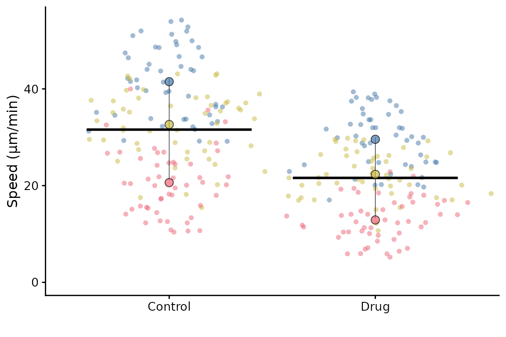
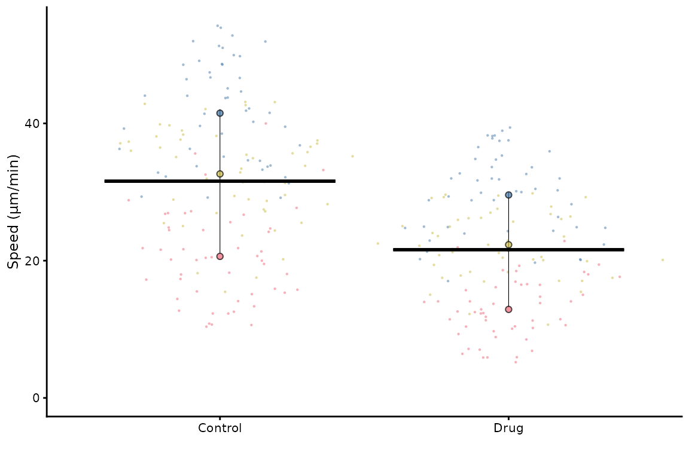
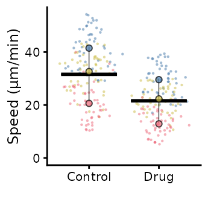
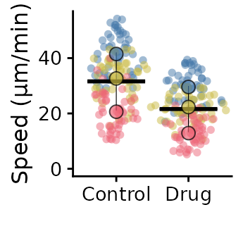
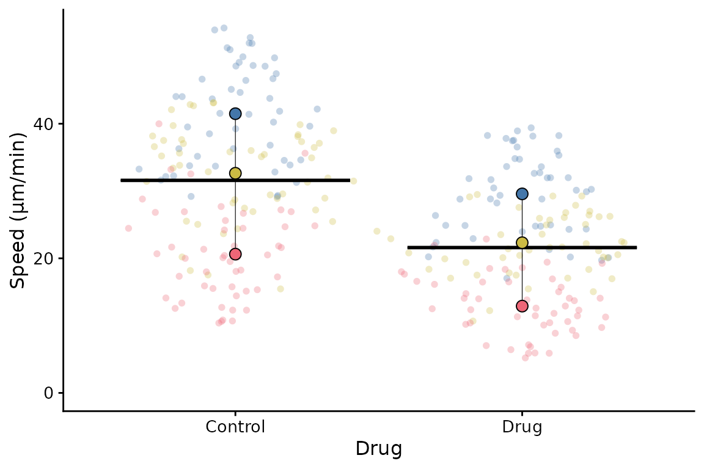
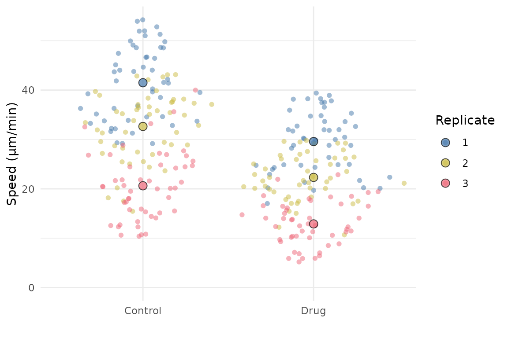
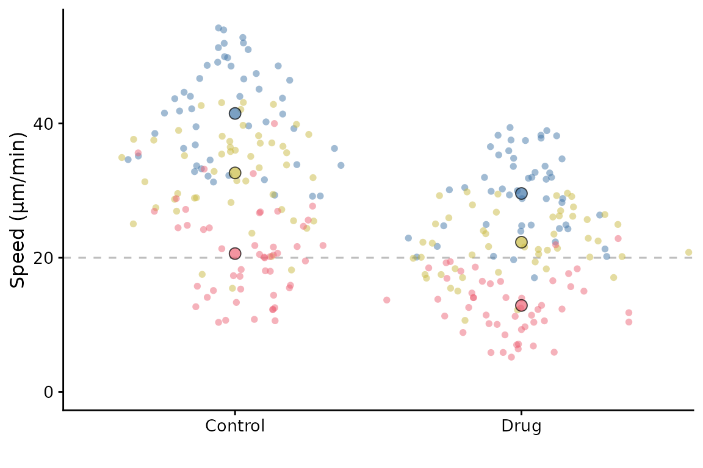
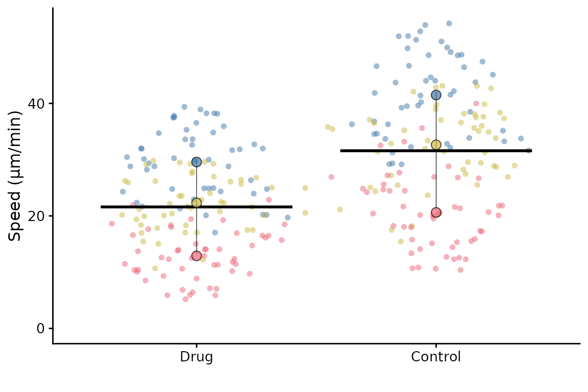
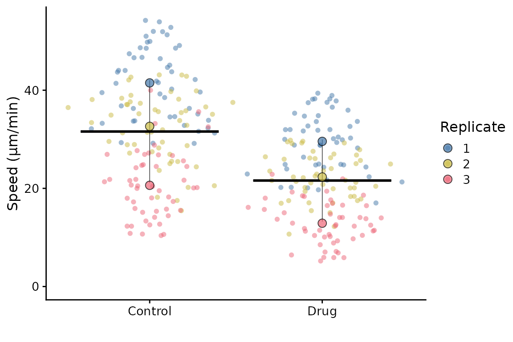

# Advanced Usage

## Advanced SuperPlots

In this vignette, we will explore some of the more advanced features of
SuperPlotR.

But first, we need to deal with how to simply scale the plot so it looks
good in your paper!

### Sizing the SuperPlot

The default setting is to use point sizes of 2 for the data and 3 for
the summary points. The font size is 12. This looks good in the RStudio
viewer, but is not well suited to a figure which is likely to be very
small.

``` r
library(SuperPlotR)
# the default plot
superplot(lord_jcb, "Speed", "Treatment", "Replicate", ylab = "Speed (µm/min)")
```



``` r
# the same plot but with custom sizing
superplot(lord_jcb, "Speed", "Treatment", "Replicate", ylab = "Speed (µm/min)",
          size = c(0.8,1.5), fsize = 9)
```



This does not look great in the viewer, but it will look better in a
figure.

``` r
library(ggplot2)
# the same plot but with custom sizing
superplot(lord_jcb, "Speed", "Treatment", "Replicate",
               ylab = "Speed (µm/min)", size = c(0.8,1.5), fsize = 9)
```



``` r
ggsave("plot.pdf", width = 88, height = 50, units = "mm") # final size
```

This is preferable to

``` r
library(ggplot2)
# the same plot but with custom sizing
superplot(lord_jcb, "Speed", "Treatment", "Replicate",
               ylab = "Speed (µm/min)")
```



``` r
ggsave("plot.pdf", width = 88, height = 50, units = "mm") # final size
```

### Customising the SuperPlot

A couple of simple tweaks: an x label can be added, and the transparency
of points can be altered like this.

``` r
superplot(lord_jcb, "Speed", "Treatment", "Replicate",
          xlab = "Drug", ylab = "Speed (µm/min)", alpha = c(0.3,1))
```



SuperPlotR returns a ggplot object which can be customised how you like.
For example, the theme can be overridden like this:

``` r
p <- superplot(lord_jcb, "Speed", "Treatment", "Replicate", ylab = "Speed (µm/min)")
p + theme_minimal()
```



It can also accept a ggplot object using the `gg` parameter, and then
add a SuperPlot to it (within reason!). For example, you might want to
plot something behind the SuperPlot.

``` r
p <- ggplot() +
  geom_hline(yintercept = 20, linetype = "dashed", col = "grey")
superplot(lord_jcb, "Speed", "Treatment", "Replicate", ylab = "Speed (µm/min)", gg = p)
```



### Ordering the x-axis

This is best done by reordering the levels of the factor in the input
dataframe before calling `superplot`.

``` r
df <- lord_jcb
df$Treatment <- factor(df$Treatment, levels = c("Drug", "Control"))
superplot(df, "Speed", "Treatment", "Replicate", ylab = "Speed (µm/min)")
```



It is also possible to reorder the Replicates using a similar strategy.
You might want to do this so that the order of colours and shapes
matches a different order to the default. Another way to achieve the
same thing is to supply a reordered colour palette to `superplot`.

### Getting information about your SuperPlot

Having made your SuperPlot, you might want to know a bit more about it.
For example, you might wonder which replicate is which or perhaps you
received a warning that some replicates are missing some conditions.

You can set the option `info = TRUE` when you call `superplot` to get
more detailed information.

``` r
superplot(lord_jcb, "Speed", "Treatment", "Replicate", ylab = "Speed (µm/min)",
          info = TRUE)
#> SuperPlot information
#> =====================
#> Number of conditions: 2
#> Number of replicates: 3
#> Number of data points: 300
#> Number of summary points: 6
#> =====================
#> Colour palette: tol_bright
#> Data distribution: sina
#> Summary statistic: rep_mean
#> No bars
#> X-axis label:
#> Y-axis label: Speed (µm/min)
#> Point sizes: 2 (individual), 3 (summary)
#> Alpha for points: 0.5 (individual), 0.7 (summary)
#> Font size: 12
#> No statistics
#> =====================
#> Colours for replicates: #4477AA, #CCBB44, #EE6677
#> Shapes for replicates: 21, 21, 21
#> =====================
#> Summary statistics:
#> # A tibble: 6 × 6
#>   Treatment Replicate rep_mean rep_median sp_colour sp_shape
#>   <chr>     <fct>        <dbl>      <dbl> <fct>     <fct>   
#> 1 Control   1             41.5       41.7 #4477AA   21      
#> 2 Control   2             32.6       34.4 #CCBB44   21      
#> 3 Control   3             20.6       20.3 #EE6677   21      
#> 4 Drug      1             29.6       30.1 #4477AA   21      
#> 5 Drug      2             22.3       21.9 #CCBB44   21      
#> 6 Drug      3             12.9       12.6 #EE6677   21
```



When this is set, the SuperPlot will contain a legend, otherwise, the
legend is not shown by default. This is because the legend is not very
useful in most cases, as the colours and shapes are already shown in the
plot. However, if you want to see the legend, you can either set
`info = TRUE` or use the append one the output using
`+ theme(legend.position = "right")`.

#### Retrieving the summary data

If you need to retrieve the summary data used to create the SuperPlot,
you can use the `get_sp_summary` function. This will return a data frame
with the summary data used to create the SuperPlot.

``` r
summary_data <- get_sp_summary(lord_jcb, "Speed", "Treatment", "Replicate")
head(summary_data)
#> # A tibble: 6 × 4
#>   Treatment Replicate rep_mean rep_median
#>   <chr>         <int>    <dbl>      <dbl>
#> 1 Control           1     41.5       41.7
#> 2 Control           2     32.6       34.4
#> 3 Control           3     20.6       20.3
#> 4 Drug              1     29.6       30.1
#> 5 Drug              2     22.3       21.9
#> 6 Drug              3     12.9       12.6
```

#### Finding representative datapoints

If you want to find the representative datapoints for each condition,
then you can use the
[`representative()`](https://quantixed.github.io/SuperPlotR/reference/representative.md)
function. This is handy if the data come from a set of images and you’d
like to show a representative image in the figure.

The function returns a data frame with the datapoints ranked by
closeness to the summary of each replicate or condition (see
[`?representative`](https://quantixed.github.io/SuperPlotR/reference/representative.md)
for more information). It also prints the top ranked datapoint to the
console.

``` r
representative_data <- representative(lord_jcb, "Speed", "Treatment", "Replicate")
#> # A tibble: 6 × 6
#>   Treatment Replicate Speed rowno     diff  rank
#>   <chr>     <chr>     <dbl> <int>    <dbl> <int>
#> 1 Control   1          41.5     5 0.0524       1
#> 2 Control   2          32.9    98 0.220        1
#> 3 Control   3          20.7   124 0.0541       1
#> 4 Drug      1          29.4   178 0.217        1
#> 5 Drug      2          22.3   207 0.000237     1
#> 6 Drug      3          12.9   285 0.0113       1
head(representative_data)
#> # A tibble: 6 × 6
#>   Treatment Replicate Speed rowno   diff  rank
#>   <chr>     <chr>     <dbl> <int>  <dbl> <int>
#> 1 Control   1          41.5     5 0.0524     1
#> 2 Control   1          41.4    13 0.0875     2
#> 3 Control   1          41.9     2 0.366      3
#> 4 Control   1          42.2    31 0.688      4
#> 5 Control   1          40.2    26 1.26       5
#> 6 Control   1          39.6    36 1.86       6
```

In this example, the dataset has no label column, so the row number is
used as the label. If you have a label column, you can specify it using
the `label` parameter. The label could be a filename or other identifier
to identify where the datapoint came from.

``` r
# Assuming lord_jcb has a column "FileName" with the labels
example <- lord_jcb
example$FileName <- paste0("Image_", seq_len(nrow(example)), ".tif")
representative_data <- representative(example, "Speed", "Treatment", "Replicate",
                                      label = "FileName")
#> # A tibble: 6 × 6
#>   Treatment Replicate Speed FileName          diff  rank
#>   <chr>     <chr>     <dbl> <chr>            <dbl> <int>
#> 1 Control   1          41.5 Image_5.tif   0.0524       1
#> 2 Control   2          32.9 Image_98.tif  0.220        1
#> 3 Control   3          20.7 Image_124.tif 0.0541       1
#> 4 Drug      1          29.4 Image_178.tif 0.217        1
#> 5 Drug      2          22.3 Image_207.tif 0.000237     1
#> 6 Drug      3          12.9 Image_285.tif 0.0113       1
```
