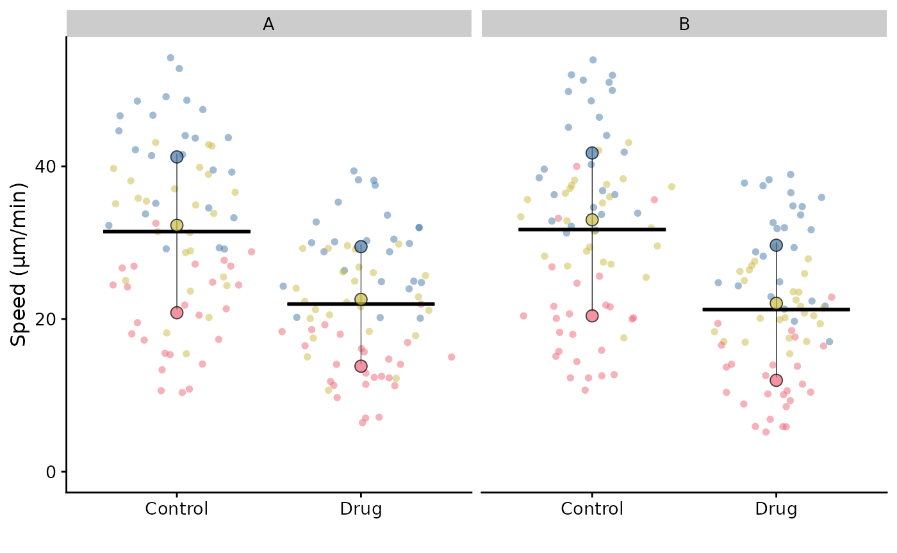
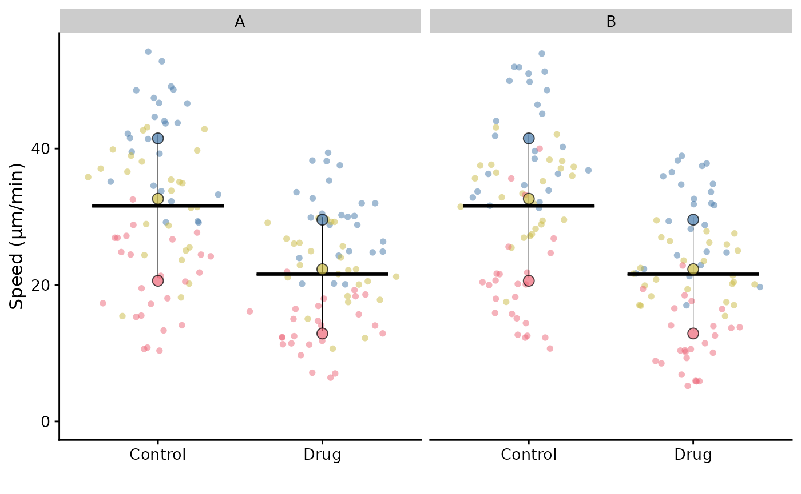
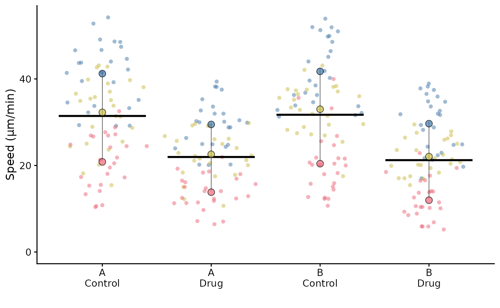
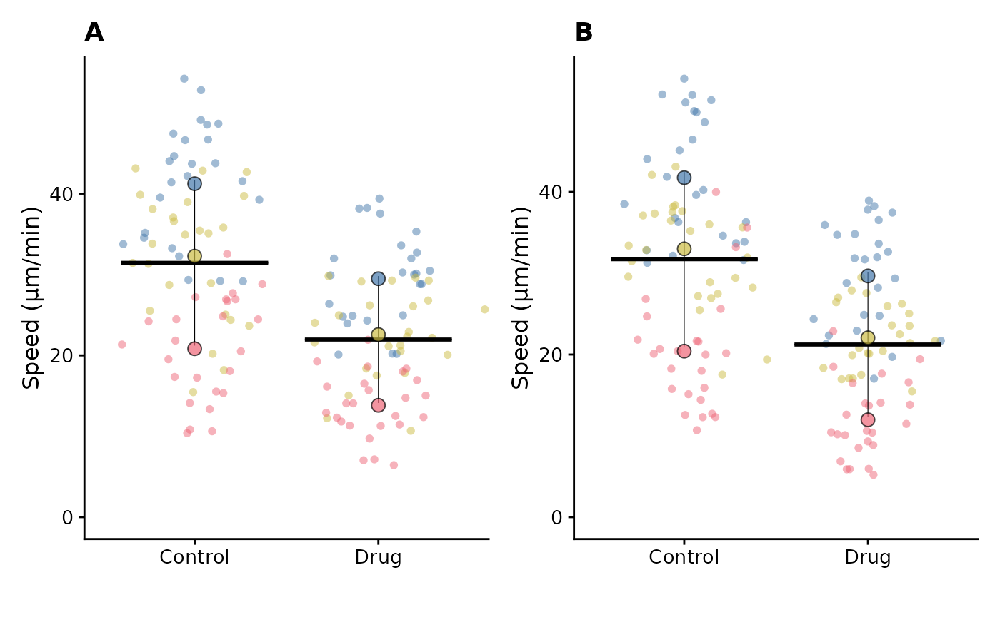

# Faceting a Superplot

When we “facet” a ggplot, we split the plot into multiple panels based
on the values of a categorical variable. This is a common way to compare
groups or conditions across different subsets of data.

Faceting is supported for SuperPlots, but the variable for faceting must
be supplied in the
[`superplot()`](https://quantixed.github.io/SuperPlotR/reference/superplot.md)
call.

``` r

library(SuperPlotR)
# add a variable to facet by to the data frame
df <- cbind(lord_jcb, other = rep(c("A", "B"), 150))
superplot(df, "Speed", "Treatment", "Replicate", facet = "other",
               ylab = "Speed (µm/min)")
```



If we fail to supply the variable for faceting in the
[`superplot()`](https://quantixed.github.io/SuperPlotR/reference/superplot.md)
call, then when the facet function is called, the summary points and
bars will be incorrect because they are calculated without the facet
variable.

``` r

library(ggplot2)
p <- superplot(df, "Speed", "Treatment", "Replicate", ylab = "Speed (µm/min)")
# incorrect output
p + facet_wrap(~ other)
```



**Note:** currently
[`facet_wrap()`](https://ggplot2.tidyverse.org/reference/facet_wrap.html)
is used, for further enhancement requests, raise an issue.

For FlatPlots (see
[`vignette("flatplot")`](https://quantixed.github.io/SuperPlotR/articles/flatplot.md)),
faceting works without additional arguments.

``` r

p <- flatplot(df, "Speed", "Treatment", ylab = "Speed (µm/min)")
p + facet_wrap(~ other)
```


## More complex faceting

In ggplot, it is possible to facet by multiple variables.

This is not currently supported in SuperPlotR. Some solutions are listed
below:

### Combine faceting variable(s) with the condition variable

Manually combine the condition column with one or more faceting
variables to create a new variable that can be used as the condition
variable in
[`superplot()`](https://quantixed.github.io/SuperPlotR/reference/superplot.md).

``` r

df_2 <- df |>
  dplyr::mutate(Treatment_other = paste(other, Treatment, sep = "\n"))
superplot(df_2, "Speed", "Treatment_other", "Replicate",
               ylab = "Speed (µm/min)")
```



In the case of two faceting variables, one could be combined with the
condition variable and the other could be used for faceting.

### Manually generate multiple SuperPlots and combine them

Make a SuperPlot for each category, i.e. after filtering the data frame
for A and B, and then combine them using
[patchwork](https://patchwork.data-imaginist.com) or similar package.

``` r

library(patchwork)
fct <- unique(df$other)
do.call(wrap_plots, c(lapply(seq_along(fct), function(i) {
  this_facet <- fct[i]
  p <- superplot(df |>
                   dplyr::filter(other == this_facet),
                 "Speed", "Treatment", "Replicate",
                 ylab = "Speed (µm/min)")
  p <- p + labs(title = this_facet)
  return(p)
}), ncol = 2)) -> p_combined
p_combined
```



In this simple case we only have two categories, but this approach can
be extended to more categories and multiple faceting variables.

## Statistical tests

When using faceting, statistical tests are not supported because it is
not clear how multiple comparison should be handled. However, using the
method above to generate multiple SuperPlots manually, it is possible to
output the statistical tests for each plot.
