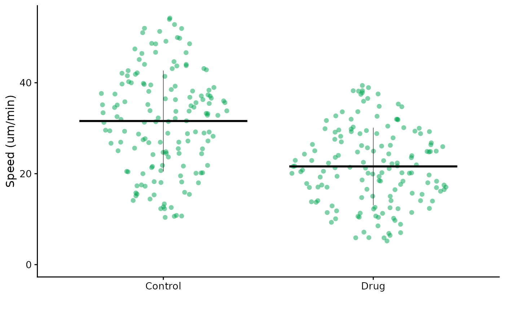
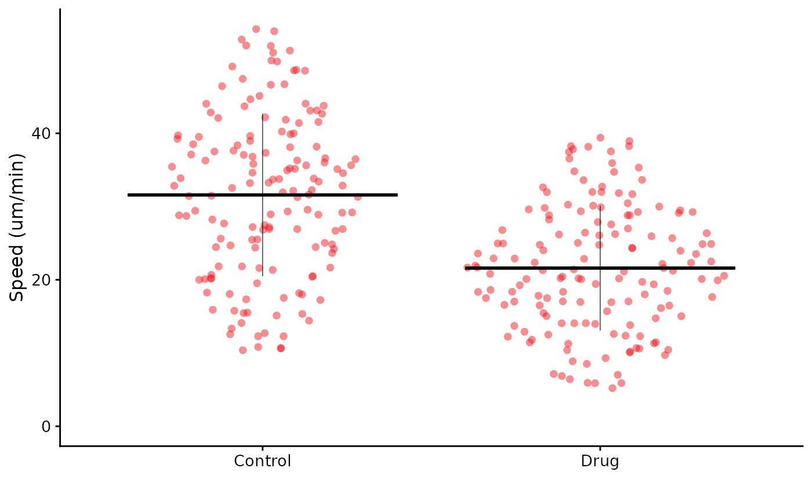
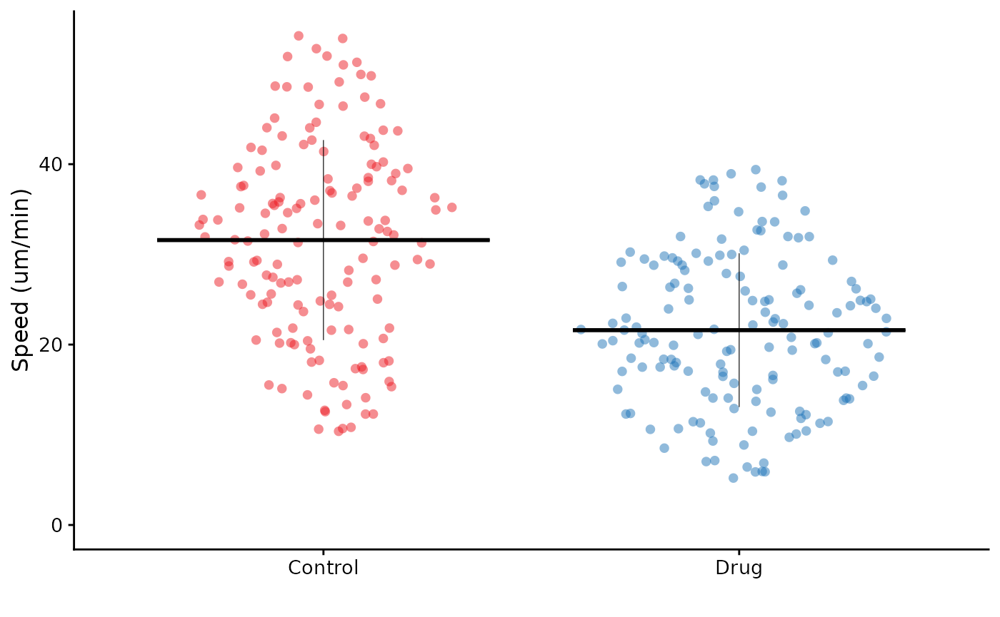
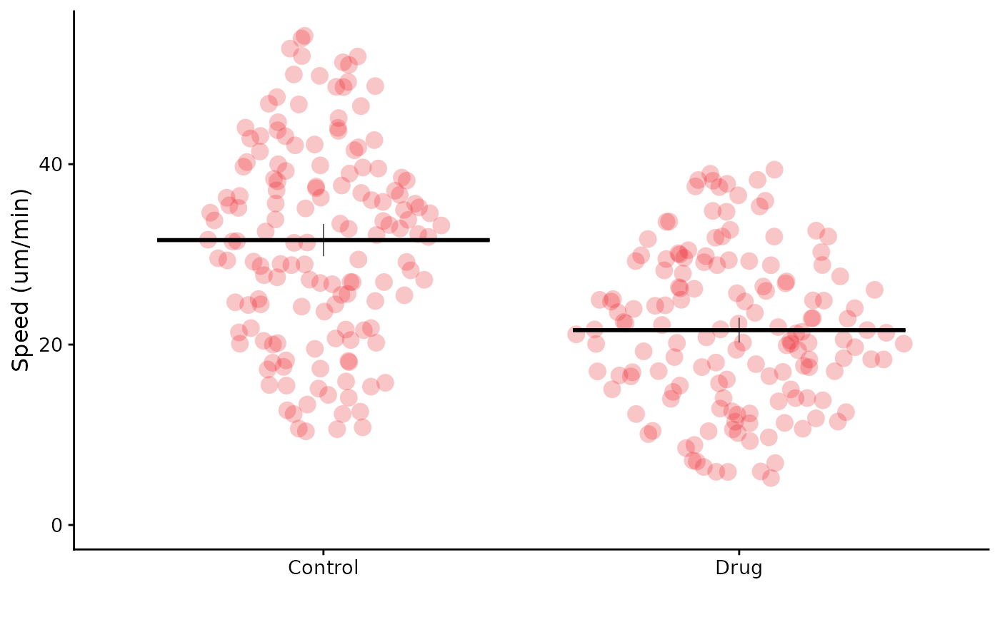

# Making non-SuperPlots - FlatPlots

## Making non-SuperPlots - FlatPlots

SuperPlotR is designed to make SuperPlots, but sometimes you just want a
simple plot. This vignette will show you how to make a “FlatPlot” using
SuperPlotR.

In contrast to SuperPlots, which emphasise the experimental replicates,
FlatPlots have a flat structure, where the replicates are not shown.
They can be used to look at data from a single experiment, or when the
replicates are the individual data points.

``` r
library(SuperPlotR)
flatplot(lord_jcb, "Speed", "Treatment", ylab = "Speed (um/min)")
```


Many of the arguments are the same as for
[`superplot()`](https://quantixed.github.io/SuperPlotR/reference/superplot.md),
but the `replicate` argument is not used.

``` r
flatplot(lord_jcb, "Speed", "Treatment", ylab = "Speed (um/min)",
         colour = "rl_green")
```



The control of colour is usually by a single colour, which can be a hex
code or one of our lab’s publication colour palette.

``` r
flatplot(lord_jcb, "Speed", "Treatment", ylab = "Speed (um/min)",
         colour = "rl_red", stats = TRUE)
#> Performing t-test
#> 
#>  Welch Two Sample t-test
#> 
#> data:  x and y
#> t = 8.7438, df = 279.51, p-value < 2.2e-16
#> alternative hypothesis: true difference in means is not equal to 0
#> 95 percent confidence interval:
#>   7.738602 12.235350
#> sample estimates:
#> mean of x mean of y 
#>  31.58355  21.59657
```



It is also possible to specify a vector of colours, which will be used
for each condition. Any extra colours are ignored, and valid inputs are
R colors, hex codes or our lab’s colour palette.

``` r
flatplot(lord_jcb, "Speed", "Treatment", ylab = "Speed (um/min)",
         colour = c("rl_red", "rl_blue", "rl_green"))
```



We can request statistical testing as for SuperPlots, but the p-values
will be calculated for the whole dataset, not for each replicate.

``` r
flatplot(lord_jcb, "Speed", "Treatment", ylab = "Speed (um/min)",
         colour = "rl_red", size = 4, alpha = 0.25,
         bars = "mean_ci")
```



In this example, we have increased the size of the points, made them
slightly more transparent, and added error bars to show the mean and 95%
confidence interval.
