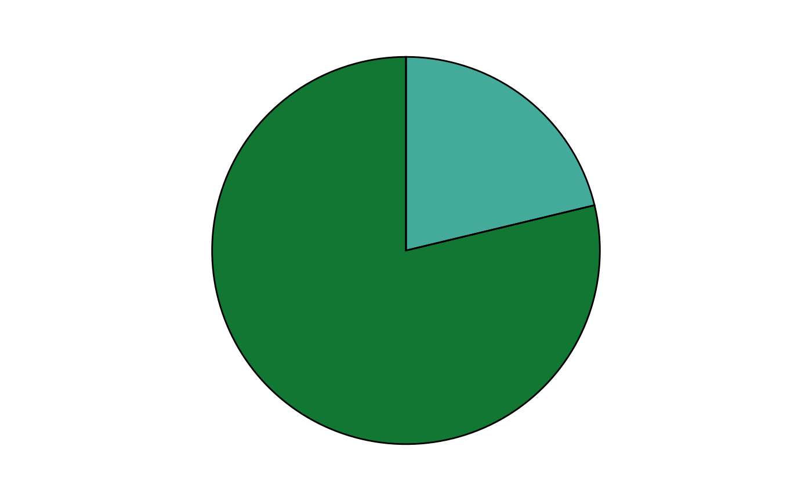
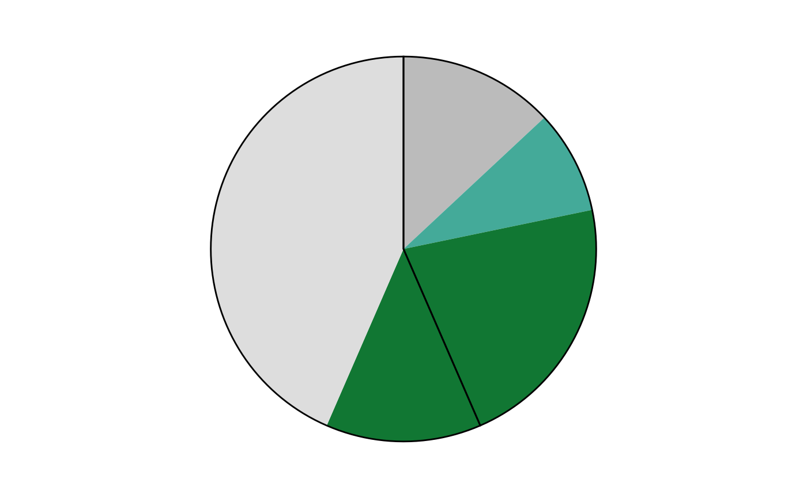
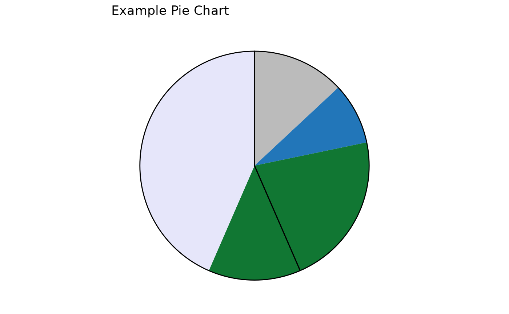

# Making non-SuperPlots - PiePlots

``` r
library(SuperPlotR)
```

## Making non-SuperPlots - FlatPlots

For convenience, SuperPlotR also provides a function to make pie charts.
Called
[`pieplot()`](https://quantixed.github.io/SuperPlotR/reference/pieplot.md),
it takes a vector of values and a vector of colours, and returns a pie
chart using `ggplot2`. It can also take a second vector of values to
create a pie chart with two layers.

``` r
pieplot(x1 = c(123, 456),
        cols = c("#44aa99", "#117733"))
```



``` r
pieplot(x1 = c(50 - 20, 20, 80, 180 - 80),
        cols = c("#bbbbbb", "#44aa99", "#117733", "#dddddd"),
        x2 = c(100, 130))
```



The `cols` argument should be a character vector of colours, which can
be hex codes or one of our lab’s publication colour palette. The
function will convert the colours to a format that `ggplot2` can use.

``` r
pieplot(x1 = c(50 - 20, 20, 80, 180 - 80),
        cols = c("#bbbbbb", "rl_blue", "#117733", "lavender"),
        x2 = c(10, 13), label = "Example Pie Chart")
```



Note that the values for the second pie chart layer do not have the same
as the first layer. The function will automatically scale the second
layer.
